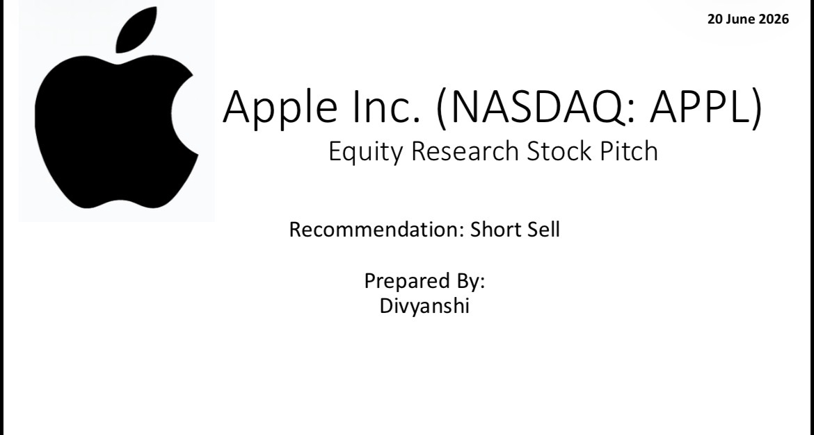

Apple Investment Pitch Deck

Overview

This repository contains a comprehensive investment pitch deck evaluating Apple Inc. from an equity research perspective.

The objective of this project was to analyze Apple’s business fundamentals, financial performance, valuation, competitive positioning, and investment attractiveness.

Contents

* Company Overview
* Industry Analysis
* Business Model
* Financial Performance Analysis
* Growth Drivers
* Risk Analysis
* Valuation
* Investment Recommendation

Tools Used

* Microsoft PowerPoint
* Microsoft Excel
* Company Annual Reports (10-K)
* Financial Statement Analysis

Key Skills Demonstrated

* Equity Research
* Investment Analysis
* Financial Statement Analysis
* Corporate Finance
* Business Strategy
* Presentation Design

Repository Files

* Apple Investment Pitch Deck

Disclaimer

This project was created for educational and portfolio purposes only and should not be considered investment advice.
